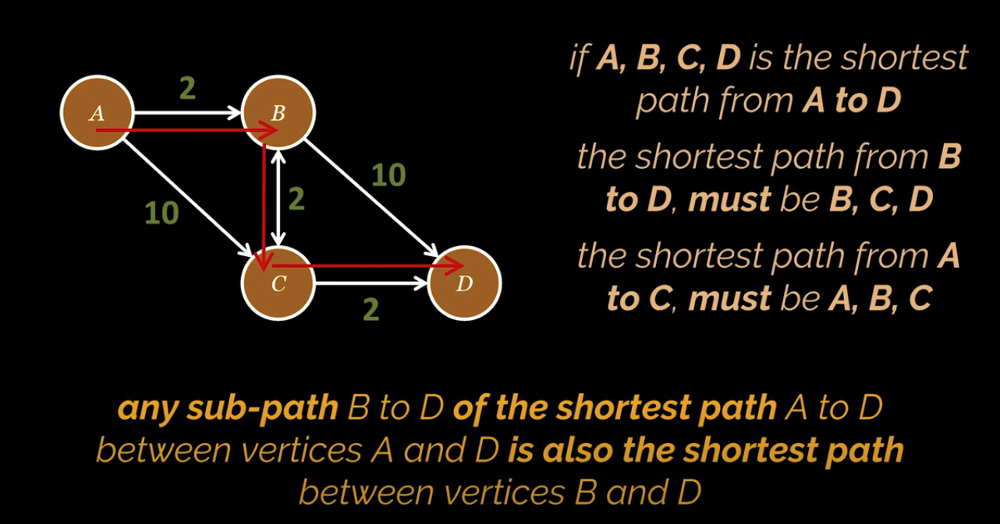

# Dijkstra's Algorithm 

### Encontrando o menor caminho entre duas vértices de um determinado grafo
---


---
- Dijkstra usa essa propriedade para retroceder o caminho mais curto na direção oposta depois de superestimar a distância de cada vértice do vértice inicial fornecido.



---
- Analisando o grafo
    - Inicializamos todos os nós com uma distânica infinita e um predecessor desconhecido, exceto pelo nó de origem que receberá uma distância igual a 0.
    
    
    
    - Neste ponto precisamos ter dois conjuntos distintos de nós:
        - **Resolvidos**:
            - São aqueles com a distância mínima conhecida como fonte
            - Distância mínima e predecessor são preenchidos e finalizados
        - **Não resolvidos**:
            - Nós que podemos alcançar a partir da origem mas que ainda não sabemos a distância mínima que os separa desse nó de origem

    

    - O algoritmo funciona da seguinte forma
        - Primeiro escolhemos o nó com a menor distância conhecida, no caso A
        - Avaliar todos os seus nós adjacentes não resolvido
        - Adicionar o peso da aresta que separa nossa fonte de seu nó adjacente à distância da fonte e comparalá-la a distância do destino.

        

        - Exemplo para o nó B: 
            - 0 + 2 é menor que infinito, então a nova distância para o nó B é 2. E o novo antecessor é A.
            - Nó A agora é considerado resolvido
            - Nós B e C são adicionados aos nós **não resolvidos** porque eles podem ser alcançados a partir da origem, mas ainda é necessário processar seus nós adjacentes e garantir que as distâncias que escolhemos sejam realmente as mínimas.
            - Com dois nós no conjuto **não resolvido** escolha aquele com a menor distância, no caso o nó B.
            - O próximo passo segue com a repetição desse processo.
            
            
            
            

        - Exemplo para nós adjacentes de B:
            - Para o próximo nó C como pode ser observado o peso da aresta de B e C adicionado a distância mínima de B é maior que a distância avaliada anteriormente de C 
            - Para a distância de C temos a distância mínima

            

---

- Código:
    - A lógica para a solução segue na classe `CalculateShortestPath` 

```java
import java.util.*;
import java.util.stream.Stream;

public class CalculateShortestPath {

    public void execute(Node source) {

        // colocando a distancia inical como zero
        source.setDistance(0);

        // criando as listas resolvidas e nao resolvidas
        Set<Node> settledNodes = new HashSet<>();
        Queue<Node> unsettledNodes = new PriorityQueue<>(Collections.singleton(source));

        // enquanto esta fila nao esteja vazia, retorno o no com a menor distancia dela
        while (!unsettledNodes.isEmpty()) {
            Node currentNode = unsettledNodes.poll();

            currentNode.getAdjacentNodes()
                    // na sequencia faça um loop pelos seus nós adjacentes
                    .entrySet().stream()

                    // filtre pelos nós que não estão resolvidos
                    .filter(entry -> !settledNodes.contains(entry.getKey()))

                    // atualize a distancia desse nó
                    .forEach(entry -> {
                        evaluateDistanceAndPath(entry.getKey(), entry.getValue(), currentNode);

                        // por fim adicione esse nó na fila dos não resolvidos
                        unsettledNodes.add(entry.getKey());
                    });

            // depois de percorrer todos os nos adjacentes, adicionamos o no com o qual estamos trabalhando no momento ao conjunto de nos resolvidos
            settledNodes.add(currentNode);
        }
    }

    private void evaluateDistanceAndPath(Node adjacentNode, Integer edgeWeight, Node sourceNode) {

        // Precisamos comparar a soma do peso da aresta e a distancia do no de origem que ele conecta com a distancia do destino
        Integer newDistance = sourceNode.getDistance() + edgeWeight;

        // se a distancia calculada for menor que a do no que estamos tentando alcancar
        if (newDistance < adjacentNode.getDistance()) {
            //Então encontramos um caminho menor e mais ideal ligando ao nó de origem
            // Para atualizar o caminho basta adicionar o no em que estamos ao caminho em questão
            adjacentNode.setDistance(newDistance);
            adjacentNode.setShortestPath(
                    Stream.concat(sourceNode.getShortestPath().stream(), Stream.of(sourceNode))
                            .toList());
        }
    }
}
```
- Executando a aplicação, criandos os nós conforme a imagem, recebemos o seguinte resultado

    

```java
Node nodeA = new Node("A");
Node nodeB = new Node("B");
Node nodeC = new Node("C");
Node nodeD = new Node("D");
Node nodeE = new Node("E");
Node nodeF = new Node("F");

nodeA.addAdjacentNode(nodeB, 2);
nodeA.addAdjacentNode(nodeC, 4);

nodeB.addAdjacentNode(nodeC, 3);
nodeB.addAdjacentNode(nodeD, 1);
nodeB.addAdjacentNode(nodeE, 5);

nodeD.addAdjacentNode(nodeE, 1);
nodeD.addAdjacentNode(nodeF, 4);

nodeE.addAdjacentNode(nodeF, 2);

calculateShortestPath.execute(nodeA);
```

```
A : 0
A -> B : 2
A -> C : 4
A -> B -> D : 3
A -> B -> D -> E : 4
A -> B -> D -> E -> F : 6
``` 

---

- Extra:
    - Todo este material pode ser consultado no vídeo:
        -  [Shortest Path | Dijkstra's Algorithm Explained and Implemented in Java | Graph Theory | Geekific](https://www.youtube.com/watch?v=BuvKtCh0SKk&ab_channel=Geekific)
